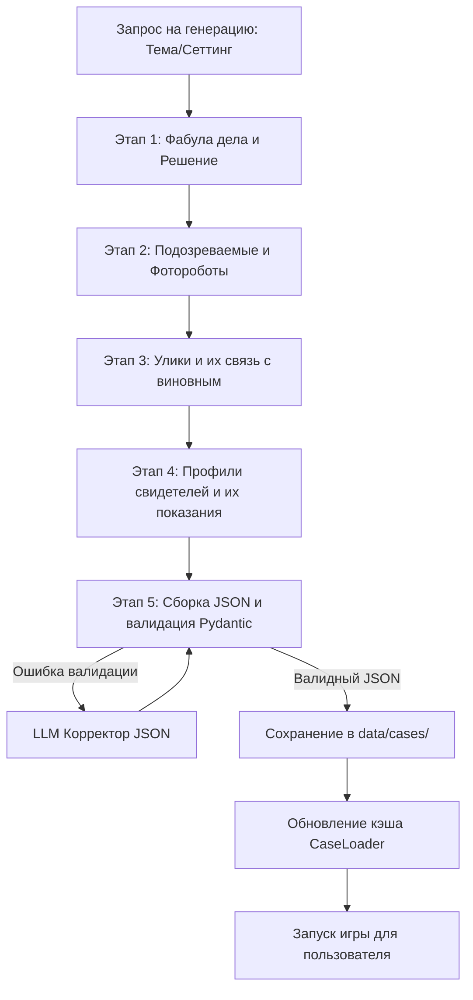

# Автоматическая генерация сценариев для «Sherlock Vision»

В данном документе представлено подробное архитектурное решение и план реализации системы автоматической (и полуавтоматической) генерации детективных сценариев для бота «Sherlock Vision». 

Цель расширения — предоставить игрокам бесконечно масштабируемый игровой опыт за счет динамического создания уникальных дел с помощью нейросетевых технологий Yandex Cloud.

---

## 1. Анализ текущей структуры бота

На данный момент архитектура игры ориентирована на статические сценарии:
* **Формат данных:** Все дела описываются в JSON-файлах в папке `data/cases/` и валидируются через Pydantic-модели в [case_models.py](file:///root/sherlock-vision/game/case_models.py).
* **Загрузка:** Класс `CaseLoader` при запуске считывает файлы из директории и сохраняет их в оперативной памяти.
* **Игровой цикл:** Взаимодействие со свидетелями ([witness_engine.py](file:///root/sherlock-vision/game/witness_engine.py)) и анализ улик ([evidence_engine.py](file:///root/sherlock-vision/game/evidence_engine.py)) происходят на лету с помощью YandexGPT, используя данные из предзагруженного JSON-дела.
* **Маршрутизация:** Запуск расследования жестко привязан к одному делу `case_001_gallery_ring` в [router.py](file:///root/sherlock-vision/core/router.py).

Для автоматической генерации сценариев нам необходимо научить систему создавать валидные JSON-файлы, соответствующие схеме `CaseData`, обеспечивая при этом логическую связность сюжета и бесконфликтность улик.

---

## 2. Архитектура системы автоматической генерации

Генерация цельного детектива за один запрос к LLM часто приводит к логическим ошибкам (галлюцинациям), невалидному JSON или нарушению причинно-следственных связей. 

Предлагается использовать **конвейерную (агентную) модель генерации**, разбитую на этапы, с последующей автоматической валидацией и коррекцией.



### Преимущества конвейерного подхода:
1. **Точность логики:** LLM на каждом шаге фокусируется на узкой задаче (например, только на генерации показаний конкретного свидетеля на основе уже готового решения).
2. **Гибкость параметров:** Игрок или администратор может задать сеттинг (например, *«Англия XIX века»*, *«Киберпанк 2077»*, *«Космическая станция»*) и уровень сложности.
3. **Экономия контекста:** Каждому подзапросу передается только необходимая информация, что снижает вероятность забывания деталей.

---

## 3. Пошаговое описание конвейера генерации

### Шаг 1: Создание ядра истории (Фабула и Решение)
**Входные данные:** Тема/сеттинг (например: «Кража в лаборатории робототехники»).
**Задача LLM:** Придумать название дела, описание места преступления, имя преступника (Culprit), способ совершения (Method), мотив (Motive) и список ключевых улик (Key Evidence).
**Системный промпт (пример):**
```text
Ты — опытный сценарист детективных игр. Твоя задача — придумать концепт и логическое решение для нового детективного дела.
Сеттинг: {setting}
Сгенерируй JSON-объект со следующими полями:
{
  "title": "Название дела",
  "intro": "Вводная информация для игрока (введение в курс дела)",
  "location": {
    "name": "Название места преступления",
    "description": "Описание места преступления с упоминанием деталей"
  },
  "solution": {
    "culprit_name": "Имя преступника",
    "method": "Как именно было совершено преступление",
    "motive": "Мотив преступления",
    "key_evidence_ideas": ["Идея улики 1", "Идея улики 2"]
  }
}
Отвечай строго в формате JSON без markdown-разметки.
```

### Шаг 2: Проработка подозреваемых (Suspects)
**Входные данные:** Ядро истории из Шага 1.
**Задача LLM:** Создать список подозреваемых (2-3 человека). Один из них — преступник из Шага 1. Для каждого подозреваемого необходимо сгенерировать имя, роль, мотив (у непричастных он должен быть ложным/недостаточным) и детальное описание внешности для YandexART.
**Внешность должна быть разбита по структуре `Appearance`:**
* `age` (возраст)
* `face` (форма лица, особенности)
* `hair` (цвет волос, прическа)
* `body` (телосложение)
* `clothes` (одежда)

### Шаг 3: Генерация улик (Evidence)
**Входные данные:** Решение дела и подозреваемые.
**Задача LLM:** Создать массив улик. Каждая улика должна иметь:
* `id` (уникальный строковый идентификатор)
* `title` (название)
* `description` (подробное описание, позволяющее эксперту-криминалисту делать выводы)
* `importance` ("high", "medium", "low")
* `linked_to` (список ID подозреваемых, с которыми связана улика)
* `can_visualize` (true/false — возможность генерации изображения)

### Шаг 4: Разработка свидетелей и показаний (Witnesses)
**Входные данные:** Список подозреваемых, улики и решение.
**Задача LLM:** Создать свидетелей. Для каждого свидетеля генерируются:
* `name` (имя)
* `role` (роль, например: «уборщик», «директор»)
* `personality` (характер для системного промпта YandexGPT, например: «высокомерный, отвечает неохотно»)
* `known_facts` (список фактов, которые свидетель знает точно и расскажет игроку. Факты должны логически дополнять картину, но не раскрывать убийцу напрямую)
* `unknown_facts` (список тем, о которых свидетель ничего не знает — для предотвращения галлюцинаций LLM во время диалога)

### Шаг 5: Сборка, Валидация и Авто-коррекция JSON
Полученные данные объединяются в структуру `CaseData` на стороне Python.
Далее запускается валидатор Pydantic. Если валидация завершается ошибкой, запускается процесс авто-коррекции:

```python
import json
from pydantic import ValidationError
from game.case_models import CaseData
from yandex_ai.yandex_gpt_client import yandex_gpt_client

async def validate_and_repair_json(raw_json_str: str) -> CaseData:
    for attempt in range(3):
        try:
            data = json.loads(raw_json_str)
            # Валидация через Pydantic
            case = CaseData(**data)
            return case
        except (json.JSONDecodeError, ValidationError) as e:
            if attempt == 2:
                raise e
            # Отправляем JSON и ошибку обратно в YandexGPT для исправления
            repair_prompt = (
                f"Исходный JSON содержит ошибки валидации:\n{str(e)}\n\n"
                f"Исправь JSON-строку, чтобы она строго соответствовала схеме:\n{raw_json_str}"
            )
            raw_json_str = await yandex_gpt_client.generate_response(
                system_prompt="Ты — валидатор JSON. Твоя задача исправить синтаксис и структуру JSON по описанию ошибок.",
                user_message=repair_prompt
            )
```

---

## 4. Интеграция с базой данных и игровым движком

Чтобы новые сценарии стали доступны пользователям, необходимо внести изменения в базу данных и логику загрузки:

### А. Изменение в схеме Базы Данных ([models.py](file:///root/sherlock-vision/database/models.py))
На данный момент `case_id` в таблице `investigations` — это простая строка. Нам необходимо отслеживать происхождение дел (базовые или сгенерированные).
Рекомендуется создать таблицу `Cases` для хранения метаданных и JSON-структуры сгенерированных дел:

```python
class CaseModel(Base):
    __tablename__ = "cases"

    id = Column(String, primary_key=True)  # e.g., 'case_gen_abc123'
    title = Column(String, nullable=False)
    description = Column(Text, nullable=True)
    is_generated = Column(Boolean, default=True)
    created_at = Column(DateTime, default=datetime.utcnow)
    data = Column(JSON, nullable=False)  # Полный JSON дела по структуре CaseData
```

### Б. Модернизация загрузчика дел ([case_loader.py](file:///root/sherlock-vision/game/case_loader.py))
`CaseLoader` должен уметь подгружать дела не только из файлов, но и из базы данных (динамически):

```python
class CaseLoader:
    # ... существующий код загрузки из папки ...

    async def get_case_async(self, case_id: str) -> CaseData | None:
        # 1. Проверяем в локальном кэше (статические дела)
        if case_id in self.cases:
            return self.cases[case_id]
            
        # 2. Ищем в БД сгенерированное дело
        async with AsyncSessionLocal() as session:
            result = await session.execute(
                select(CaseModel).where(CaseModel.id == case_id)
            )
            db_case = result.scalar_one_or_none()
            if db_case:
                # Превращаем JSON из БД в Pydantic модель
                return CaseData(**db_case.data)
        return None
```

### В. Обновление игрового меню ([vk_keyboards.py](file:///root/sherlock-vision/vk_bot/vk_keyboards.py) и [router.py](file:///root/sherlock-vision/core/router.py))
В главное меню бота добавляется кнопка **«Сгенерировать случайное дело»**:

1. При нажатии запускается асинхронный процесс генерации (игроку отправляется сообщение *«Наш детективный отдел подбирает для вас новое запутанное дело. Пожалуйста, подождите...»*).
2. Вызывается генератор сценариев.
3. Готовый сценарий сохраняется в БД.
4. Создается запись расследования (`Investigation`) с `case_id = <id_сгенерированного_дела>`.
5. Игрок перенаправляется в игровой цикл.

---

## 5. Способы расширения пользовательского опыта (UX)

Интеграция автогенерации открывает следующие возможности для улучшения геймплея:

1. **Выбор тематики и сложности:**
   Перед началом игры бот предлагает инлайн-клавиатуру:
   * **Сеттинг:** Классический детектив (Лондон XIX в.), Нуар (Чикаго 1930-х), Научная фантастика (Марсианская колония), Фэнтези (Гильдия магов).
   * **Сложность:** Легко (2 свидетеля, явные улики), Средне, Сложно (запутанные мотивы, свидетели могут недоговаривать).
2. **Динамическая генерация картинок улик:**
   Если в `Evidence` стоит флаг `can_visualize: true`, то при осмотре улики в первый раз бот может автоматически запустить YandexART для генерации изображения этой улики (например, *«разбитые старинные карманные часы с гравировкой»*).
3. **Система рейтингов и шеринга:**
   После завершения дела игрок может поставить оценку сгенерированному сценарию (от 1 до 5 звезд). Удачные дела (оценка 4+) можно сохранять в «Общую базу дел», чтобы другие игроки могли проходить лучшие сценарии, сгенерированные сообществом.
4. **Кооперативный режим:**
   Поскольку сценарии генерируются в БД, несколько пользователей в рамках беседы VK могут расследовать одно и то же дело сообща, опрашивая свидетелей по очереди.

---

## 6. Потенциальные проблемы и пути решения

| Проблема | Причина | Способ решения |
| :--- | :--- | :--- |
| **Синтаксические ошибки в JSON** | LLM добавляет лишний текст, разметку ```json ... ``` или путает запятые. | Использовать регулярные выражения для извлечения JSON, применять библиотеку `dirtyjson` или запускать агент-корректор (Шаг 5). |
| **Логические тупики** | Ключевая улика ведет к невиновному подозреваемому. | Строгая валидация логических связей в Pydantic на уровне связей `linked_to` и `solution.key_evidence`. |
| **Длительное ожидание** | Генерация через YandexGPT Pro занимает до 10-15 секунд на шаг конвейера. | Асинхронный фоновый воркер (аналогично генерации изображений). Игрок видит прогресс-бар: *«[██░░░] Допрос свидетелей прописывается...»* |
| **Дублирование сюжетов** | Шаблоны генерации повторяются. | Использование динамического пула "случайных зацепок" (seeds) и вводных параметров при старте генерации. |

---

## 7. Дорожная карта реализации (Roadmap)

### Этап 1: Движок генерации (1-2 дня)
* Реализация REST-интеграции с YandexGPT Pro для структурированного вывода.
* Написание класса `ScenarioGenerator` с 5-этапным конвейером.
* Написание валидатора и тестов для проверки логической связности сгенерированных JSON.

### Этап 2: Интеграция с БД и движком (1-2 дня)
* Миграция БД (добавление таблицы `cases`).
* Асинхронная интеграция `CaseLoader` с поиском дел в таблице `cases`.
* Реализация фоновой задачи для генерации дела без блокировки основного потока бота.

### Этап 3: Интерфейс бота (1 день)
* Добавление кнопки «Сгенерировать случайное дело».
* Создание инлайн-меню выбора сеттинга и сложности.
* Реализация процесса ожидания генерации с отправкой промежуточных статусов игроку.